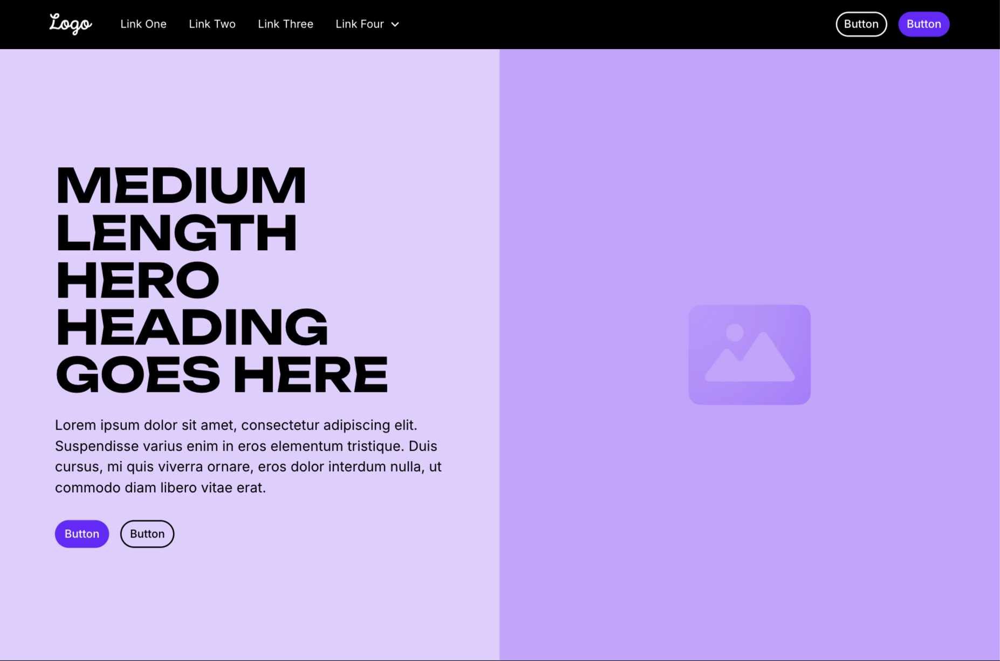

💼 Frontend Developer Portfolio

A modern web developer portfolio created with Next.js, Redux Toolkit, Tailwind CSS, Framer Motion, React Hook Form + Zod, and EmailJS.
The project demonstrates the ability to work with the current frontend stack — from responsiveness to animations and SEO.

✨ Features

✅ Hero section with developer presentation
✅ About Me — short biography + technology stack
✅ Skills — interactive technology icons
✅ Projects — dynamic rendering from data
✅ Contact — form that sends a letter to email (EmailJS)
✅ Dark/Light Theme — saving via Redux + localStorage
✅ Framer Motion animations
✅ Full responsiveness
✅ SEO and OpenGraph metadata
✅ Deployment on Vercel

⚙️ Technologies

• Next.js 14+ (App Router)
• Redux Toolkit (theme storage)
• Tailwind CSS
• Framer Motion (animations)
• React Hook Form + Zod (validation)
• EmailJS (form submission)
• Next Metadata API (SEO)
• Vercel (deployment)

🧱 Project structure
project-root/
├── app/
│   ├── layout.jsx
│   ├── page.jsx
│   ├── globals.css
│   ├── components/
│   │   ├── Header.jsx
│   │   ├── Hero.jsx
│   │   ├── About.jsx
│   │   ├── Skills.jsx
│   │   ├── Projects.jsx
│   │   ├── ContactForm.jsx
│   │   └── Footer.jsx
│   ├── store/
│   │   ├── store.js
│   │   └── themeSlice.js
│   └── data/
│       └── projects.js
├── public/
│   ├── favicon.ico
│   ├── preview.png
│   └── icons/
├── package.json
├── tailwind.config.js
└── README.md

⚡️ This is the basic minimum start, which works immediately after npm install + npm run dev.